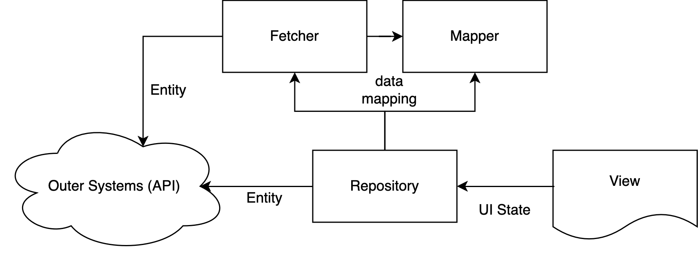

# Architecture: Feature Repository

## 개요

일반적으로 Web Frontend 프로젝트를 구성하는 각 기능 모듈들은 그 업무를 구성하는 도메인 로직이 오로지 사용자가 보게 될 화면(View)을 기반으로 동작되도록 설계됩니다.

이 때 View 에서 쓰이는 자료들을 `UI State` 라 부르며 View 는 오로지 이 `UI State` 에만 관심 가지도록 설계하고 만들게 됩니다.

리포지터리(Repository)는 이러한 `UI State` 만을 제공하거나 받아들이면서 외부와 직접 통신하는 역할을 맡습니다.

이를 통하여 View 는 외부 환경을 알지 못하게 하고,
외부 환경(DB, API, OS 등등)은 View 에 대해서 알지 못하게 함으로써
두 시스템간의 결합도(coupling)를 끊는 역할을 가집니다.

> ℹ️ 외부 환경
>
> 클라이언트가 비즈니스 로직을 구성할 때 필요한 외부 리소스들을 통칭합니다.
>
> 가령 Database, API, Operating System, File System, 운영환경, 서버 등이 있습니다.

## 주요 역할

Repository 는 다음과 같은 역할을 맡습니다.

- 정의된 UI State 를 필요에 따라 제공함.
  - 이 때 외부에서 전달 받은 Entity 타입을 UI State 로 바꿔줌.
- UI State 를 전달받아 `외부 세계`로 전달함.
  - 내부에서 전달 받은 UI State 타입을 Entity 로 바꾸어 사용

## 구성 요소

<!--
# features
## someModule
### repositories
#### mappers
##### someModule.mapper.ts
##### someModule.create.ts
#### fetchers
##### SomeModuleFetcher.ts
##### AnotherSubFetcher.ts
#### someModule.repo.ts
#### jordy.repo.ts
#### pomeLover.repo.ts
-->
```
/src
└── features
    └── someModule
        └── repositories
            ├── mappers
            │   ├── someModule.mapper.ts
            │   └── someModule.create.ts
            ├── fetchers
            │   ├── SomeModuleFetcher.ts
            │   └── AnotherSubFetcher.ts
            ├── someModule.repo.ts
            ├── jordy.repo.ts
            └── pomeLover.repo.ts
```

Repository 를 구성하는 하위 구성요소들은 다음과 같습니다.

| 명칭       | 예시                         | 역할                                                             |
| ---------- | ---------------------------- | ---------------------------------------------------------------- |
| Repository | myPome.repo.ts            | 리포지터리 역할을 맡는 단일 함수, 혹은 객체 인스턴스 모음        |
| Mapper     | mappers/myPome.mapper.ts  | Entity 를 UI State 로, 혹은 그 반대로 자료 변환을 하는 기능 모음 |
| Fetcher    | fetchers/MyPomeFetcher.ts | 자료 변환이 단순 Mapper 만으로 어려울 때 사용되는 하위 서비스.   |



### Repository

주로 Action Effect 에서 직접 호출 할 때 쓰이는 비동기 호출 함수를 지칭합니다.

(필요에 따라 Container, Page 컴포넌트, query hooks 등에서도 호출 할 수 있습니다. 단, UI Component 나 utility 등에서는 직접 호출해서는 안됩니다.)

repository 함수는 repository 계층에서 쓰이는 여러 기능 중, 다른 계층(주로 Store 나 Container)에서 사용할 수 있도록 내어주는 유일한 기능입니다.

따라서 외부에서는 반드시 이 곳 기능만을 import 하여 사용할 수 있습니다.

**파일명 규칙**

```
{someName}.repo.ts
```

아래는 단일 비동기 함수를 작성하여 운영할 때 예시입니다.

```ts
import api from '@core/api';
import { OrderListParams } from '@core/entities';
import { OrderListSearchUiParams } from '../uiStates';
import { toOrderListParams, toOrderListUiState } from './mappers';

export async function fetchOrderList(params: OrderListSearchUiParams) {
  const serverParams: OrderListParams = toOrderListParams(params);
  const response = await api.some.middle.path.fetchOrderList(serverParams);

  return response.data.payload.map(toOrderListUiState);
}
```

> ℹ️ Repository 는 꼭 함수여야 하나요? 🤔
>
> 반드시 함수일 필요는 없으며 인스턴스 객체도 가능합니다.
>
> 다만 리포지터리는 그 목적상, 외부에서는 매우 간편하게 호출하여 자료를 주고 받는 것이 목적이므로, 일반적으로 함수로 구성 되는 경우가 많을 뿐입니다.
>
> 리포지터리 구성 시 주의해야 할 사항은 오직 `사용 방법이 지나치게 복잡해지지 말것` ...입니다.

### Mapper

Mapper 는 Repository 나 Fetcher 내부에서 __자료를 변환하거나 생성할 때 쓰이는 함수들__ 입니다.

주로 외부 데이터인 `Entity` 를 내부 데이터인 `UI State` 로 바꾸거나 혹은 그 반대의 기능을 제공합니다.

#### 함수 작성 방법

mapper 는 크게 생성(creation)과 변환(transformation), 정제(refinement) 3가지로 나뉘어집니다.

이들은 특별한 사유가 없다면 가급적 순수 함수(pure function)로 작성 되어야 합니다.

mapper 함수명 예시는 다음과 같습니다.

| prefix                         | desc.                                                                                             | examples                                                                         |
| ------------------------------ | ------------------------------------------------------------------------------------------------- | -------------------------------------------------------------------------------- |
| create                         | UI State 혹은 Dto 와 같은 데이터 생성 팩토리.                                                     | createMemberInfoUiState<br/>createProductDetailDto<br/>createCoordiUpdatePayload |
| convert<br/>convertAToB<br/>to | 자료 1:1 변환기.                                                                                  | convertToViewUiState<br/>toOrderUiState<br/>toUpdateParams                       |
| combine<br/>combineAs          | 2개 이상의 데이터를 1개의 데이터로 변환.                                                          | combineAsStoreUiState<br/>combineUserAndPartnerAsCompanyParams                   |
| refine                         | 1개 데이터에서 의도된 범위로 각 필드값을 조정함.<br/>데이터 내 필드가 일관성을 유지하도록 변경함. | refinePageUiParams<br/>refineUserInputUiState                                    |

#### 파일 위치와 명칭

특별한 사유가 없는 한, mapper 들의 위치는 각 repositories 내 `mappers` 폴더에 두어야 합니다.

또한 이들 파일명은 다음과 같은 규칙을 갖습니다.

| name pattern                 | desc.                  | examples                                     |
| ---------------------------- | ---------------------- | -------------------------------------------- |
| {featureOrSubName}.create.ts | 데이터 생성 함수 모음. | orderProduct.create.ts                       |
| {featureOrSubName}.mapper.ts | 데이터 변환 함수 모음. | storeInfo.mapper.ts<br/>userDetail.mapper.ts |

#### 코드 예시

아래는 간단한 Entity -> UiState 변경 함수 예시입니다.

```ts
import dayjs from 'dayjs';
import { OrderListSearchEntity } from '@core/entities';
import { OrderListSearchUiState } from '../../uiStates';

export function toOrderListSearchUiState(entity: OrderListSearchEntity) {
  const result: OrderListSearchUiState = {
    id: entity.orderId,
    productName: entity.product.name,
    userName: entity.user.name,
    // 필수는 아니나 ui state 에 포매팅 해서 전해 줄 필요가 있다면 이렇게 유틸리티를 이용해도 됩니다.
    createdAt: dayjs(entity.created_at).format('YYYY-MM-DD')
  };

  return result;
}
```

### Fetcher

fetcher 는 mapper 만으로 해결하기 어려운 데이터 처리 문제를 해결하기 위한 `Service` 객체 입니다.

때문에 내부적으로 core 모듈의 `API` 를 직접 호출할 수 있으며 같은 계층에 위치한 `mapper` 역시 import 하여 응용할 수 있습니다.

fetcher 역할을 맡는 타입(class or interface)들은 반드시 접미어(suffix)로 `Fetcher` 를 명시 해 두어야합니다.

또한 그 코드들은 repositories 폴더 내 `fetchers` 라는 하위 폴더에 둡니다.

**파일 위치와 명칭**

```
repositories/fetchers/{SomeName}Fetcher.ts
```

#### 코드 예시

아래는 룩핀 애용자(Pome Lover)를 조회하는 fetcher 를 예시로 든 것입니다.

```ts
// repositories/fetchers/PomeLoverFetcher.ts

import api from '@core/api';
import { PomeLoverSearchParams, SomeVisitor } from '../../uiStates';

// 업무 복잡도에 따라 요청 파라미터를 `SomeVisitor` 에게 맡긴 결과를 써야 하고,
// 이 후 응답된 결과물도 `SomeVisitor` 가 제공하는 별도의 프로세싱을 거쳐야 한다고 가정했을 때 코드입니다.

export class PomeLoverFetcher {
  constructor(private processVisitor: SomeVisitor) {}

  async fetch(params: PomeLoverSearchParams) {
    const serverParams = this.processVisitor.parseParameter(params);
    const response = await api.pome.lovers.fetchList(serverParams);

    const result = this.processVisitor.someComplexProcessing(response.data.payload);

    return result;
  }
}
```

이 내용을 repository 에서 사용할 때의 예시는 다음과 같습니다.

```ts
// repositories/pomeLover.repo.ts

// PomeLoverVisitor 는 SomeVisitor 를 구현한 클래스 입니다.
import { PomeLoverVisitor } from './fetchers/PomeLoverVisitor';
import { PomeLoverFetcher } from './fetchers/PomeLoverFetcher';
import { PomeLoverSearchParams } from '../uiStates';

export async function fetchPomeLovers(params: PomeLoverSearchParams) {
  const fetcher = new PomeLoverFetcher(
    new PomeLoverVisitor()
  );

  const result = await fetcher.fetch(params);

  return result;
}
```

## 주의사항

Repository 계층에서 제공되는 repository 함수들을 제외한 Mapper 나 Fetcher 는 절대 Repository 계층을 넘어선 다른 곳에서 쓰여서는 안됩니다.

만약 Fetcher 와 동일 혹은 그와 유사한 기능이 외부에서 필요하다면, 별도 repository 함수나 객체를 만들어서 그 것을 참조하도록 해야합니다.

그럼에도 업무 복잡성 때문에 Fetcher 자체가 필요한 경우라면, 그건 설계 미스라 볼 수 있기에 `설계를 다시 해 보시길 권장`합니다.

> ℹ️ UI State 를 만드는 create 함수가 중복되어요! 😱
> 
> 데이터 생성 함수인 create 같은 경우, `repositories` 바깥의 `manipulates` 의 내용과 중복되는 경우가 생길 수 있습니다.
>
> 가령 repository 내에서 자료 변환 시, `createUserUiState` 를 이용하여 생성되지만, redux store 에서도 상태값 초기화의 목적으로 `createUserUiState` 가 사용되는 경우입니다.
>
> 이 때는 각 계층을 넘나드는 것을 권장하지 않는바, 같은 내용을 copy & paste 하여 각 계층별로 따로 기능을 둘 것을 권장합니다! 😉
