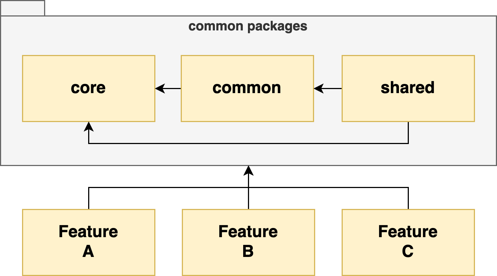

# Architecture: Folder Structure

본 문서는 아키텍처 운용 방법 중 `폴더 구조` 에 대하여 설명 합니다.



하나의 프로젝트를 구성하는 폴더는 크게 4가지로 분류됩니다.

- core : 코어 모듈
- common : 공통 모듈
- shared : 공유 모듈
- features : 기능 모듈

| 명칭     | 역할                                                    | 원칙 및 제약                                                                                |
| :------- | :------------------------------------------------------ | :------------------------------------------------------------------------------------------ |
| core     | 네트워크, 엔티티 및 리포지터리 선언                     | 프로젝트 내 그 어떤 모듈도 import 불가<br/>역할 외 다른 기능 제공 불가                      |
| common   | 공통기능 모음                                           | 오직 core 모듈만 import 가능<br/>스토어 및 자체 업무 구성 불가                              |
| shared   | 다른 기능 모듈에서 공유되는 하위 기능 구현 및 공유      | common 과 core 모듈 요소만 import 가능<br/>페이지 및 라우트 구성 불가                       |
| features | 페이지나 라우트, 혹은 정의된 특정 구현이 담긴 기능 모듈 | common, core, shared 모듈 내 요소 import 가능. 그러나 다른 feature 모듈 내 요소는 접근 불가 |

<!--
/src
# core
# common
# shared
# features
-->

```
/src
├── core
├── common
├── shared
└── features
```

## 하위 폴더 구조

아래는 `core` 를 제외한 모듈 내 포함될 수 있는 하위 폴더, 혹은 파일들 입니다.

| 명칭         | 역할                                                       | 불가 여부   |
| ------------ | ---------------------------------------------------------- | ----------- |
| components   | UI 컴포넌트 모음                                           |             |
| containers   | 컨테이너 컴포넌트 모음                                     | common 불가 |
| pages        | 페이지 컴포넌트 모음                                       | shared 불가 |
| contexts     | 컨텍스트 모음                                              |             |
| hooks        | 컴포넌트에서 쓰이는 훅스 모음                              |             |
| hoc          | 컴포넌트에서 쓰이는 High Order Component                   |             |
| constants    | 상수모음                                                   |             |
| uiStates     | UI 상태, UI 컴포넌트 전용 타입 모음                        |             |
| manipulates  | 데이터 조작기 모음                                         |             |
| stores       | Redux Slice, Effect, Selector 등                           | common 불가 |
| queries      | Query Hooks 혹은 Mutation Hooks 모음                       | common 불가 |
| libs         | 외부 라이브러리에 대해 wrapping 된 `facade interface` 제공 |             |
| utils        | 부속 유틸리티 함수, 객체 혹은 클래스들                     |             |
| utilsDom     | DOM 이나 React Component 등을 조작하는 유틸리티 모음       |             |
| services     | 서비스 객체 혹은 클래스                                    |             |
| repositories | 리포지터리와 부속 기능들                                   | common 불가 |
| validates    | 유효성 검증기                                              |             |
| reducers.ts  | 현재 모듈에서 쓰이는 리듀서 모음                           | common 불가 |
| routes.ts    | 현재 모듈에서 정의된 페이지와 라우트 설정                  | shared 불가 |

> ℹ️ Facade Interface
>
> 외부 라이브러리가 여러 복잡한 기능과 다양한 사용방법을 제시할 때 그 것을 간단하게 쓸 수 있는 객체 형태로 감싸서 프로젝트에 응용하는 방법을 일컫습니다.
>
> 이러한 SW 설계 패턴을 `Facade Pattern` 이라 부릅니다.
>
> 참고: [Facade Pattern](https://refactoring.guru/ko/design-patterns/facade)

> ℹ️ 특정 내용이 shared 와 common 모듈에서 제외되는 이유
>
> 컨테이너와 스토어는 `하나의 완성된 업무를 구성하는 요소` 입니다.
> common 은 공통으로 쓰이는 부품들을 모아놓은 곳이므로 절대 하나의 완성된 업무를 구성할 수 없습니다.
> 만약 스토어와 컨테이너를 응용하되 여러곳에서 쓰여야 한다면, 이건 `shared` 에서 만들어 공유해야 합니다.
>
> 한편, 페이지를 만들고 그것의 라우트 설정을 하고자 한다면, 이 것은 shared 가 아닌 기능 모듈(feature module)에 정의하여 사용해야 합니다.
> 만약 페이지 자체가 동일한 패턴을 가지고 여러 모듈에서 쓰인다 하면, 그 내부의 Container 나 Store 요소들만 shared 에 남기고,
> 페이지 컴포넌트 및 라우트 설정은 모두 기능 모듈에 따로 정의하여 사용합니다.

상기 표의 구성 요소들은 가능한 한 선언된 부모 모듈 내에서만 사용되어야 합니다.

<!--
/src/features/{ohMyPome}

# components
## loves
### _stories
#### OhMyPomeView.stories.tsx
### OhMyPomeView.tsx
# containers
# pages
# contexts
# hooks
# hoc
# constants
# uiStates
## ohMyPome.uiState.ts
## bestCoordi.uiState.ts
# manipulates
## ohMyPome.create.ts
## ohMyPome.convert.ts
# repositories
## fetchers
### OhMyPomeLoveFetcher.ts
## mappers
### ohMyPomeLoves.create.ts
### ohMyPomeLoves.mapper.ts
## ohMyPomeLoves.repo.ts
# stores
## loves
### ohMyPomeLoves.effect.ts
### ohMyPomeLoves.slice.ts
### ohMyPomeLoves.selector.ts
# queries
# libs
# utils
# utilsDom
# services
# validates
# reducers.ts
# routes.ts
-->

기능 모듈 내 폴더 구성 예시


```
/src/features/ohMyPome
├── components
│   └── loves
│       ├── _stories
│       │   └── OhMyPomeView.stories.tsx
│       └── OhMyPomeView.tsx
├── containers
├── pages
├── contexts
├── hooks
├── hoc
├── constants
├── uiStates
│   ├── ohMyPome.uiState.ts
│   └── bestCoordi.uiState.ts
├── manipulates
│   ├── ohMyPome.create.ts
│   └── ohMyPome.convert.ts
├── repositories
│   ├── fetchers
│   │   └── OhMyPomeLoveFetcher.ts
│   ├── mappers
│   │   ├── ohMyPomeLoves.create.ts
│   │   └── ohMyPomeLoves.mapper.ts
│   └── ohMyPomeLoves.repo.ts
├── stores
│   └── loves
│       ├── ohMyPomeLoves.effect.ts
│       ├── ohMyPomeLoves.slice.ts
│       └── ohMyPomeLoves.selector.ts
├── queries
├── libs
├── utils
├── utilsDom
├── services
├── validates
├── reducers.ts
└── routes.ts
```

### shared 모듈 사용 제약

shared 모듈의 주요 목적은 `이미 만들어진 기능을 다른 기능 모듈에 공유(sharing) 한다` 는 것입니다.

따라서 이미 만들어진 기능을 공유하는 곳이기에, 다른 곳에서 제한적으로 import 하여 응용해야합니다.

기능 모듈에서 접근 가능한 하위 요소들은 다음과 같습니다.

- 언제나 가능 👍
  - container 나 redux store 구성요소 (selector, effect)
  - uiStates
  - queries (query hooks, mutation hooks)
- 가능하지만 가급적 지양 🤔
  - manipulates
  - services
  - validates

아래는 하시면 안됩니다! 😱

- 불가
  - components
  - contexts
  - hooks
  - utils
  - utilsDom
  - 그 외 모든 것들

> ℹ️ 팁
>
> 만약 shared 내 component 나 util 과 같은 단일 요소가 공통으로 쓰인다면 이러한 요소들은 `copy & paste` 하거나 `common`으로 옮겨야 합니다.

## 하위 폴더 (core 모듈 전용)

아래는 `core` 모듈 내에서만 포함되는 하위 폴더, 혹은 파일들 입니다.

| 명칭            | 역할                                                                              |
| --------------- | --------------------------------------------------------------------------------- |
| entities        | API 데이터 타입 정의                                                              |
| apis            | 데이터 통신을 하는 BE API 서비스 정의                                             |
| services        | 코어 모듈에서 쓰이는 각종 서비스들.<br/>필요하다면 외부 모듈에서 참조 가능.       |
| headers.ts      | 네트워크 통신 시 필요한 각종 헤더 정의.<br/>networks(Client Adapter) 에서 사용됨. |
| networks.ts     | 네트워킹을 간편히 수행하는 Client Adapter 정의.<br/>리포지터리에서 사용됨         |
| storages.ts     | 로컬 스토리지를 간편히 수행하는 서비스 객체 및 보안 토큰 제공자 정의              |
| interceptors.ts | Client Adapter 에서 쓰이는 인터셉터 정의                                          |

> ⚠️ 주의
>
> 코어 모듈은 오로지 API와 스토리지, 서비스, 그리고 이들을 이용시 기본적으로 파생되는 Entity 타입만 제공해야 합니다.
>
> 단순히 공통으로 쓰이는 목적이라면 `common` 으로, 완성된 기능이나 자료를 공유해야 한다면 `shared` 에 두어야합니다.