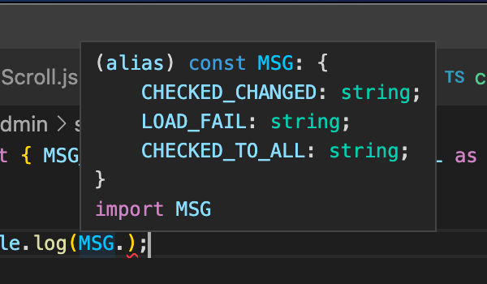
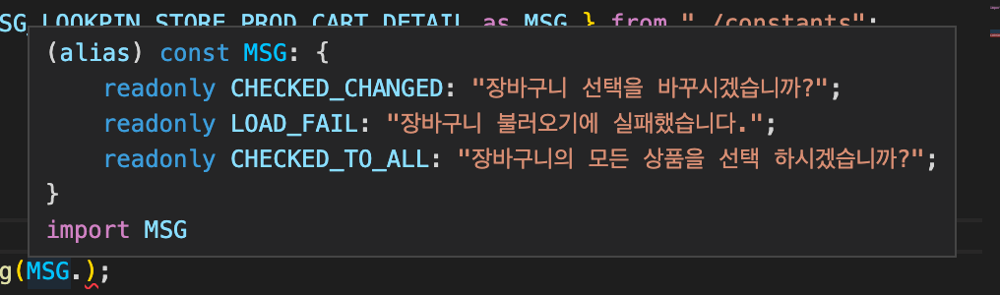

# Naming: Constants

상수는 변하지 않는 값으로써 개발 시 변수만큼 자주 쓰이게 됩니다.

이 때 상수명 작성 시 빈번히 발생되는 패턴을 아래와 같이 정리 해 둡니다.

> 참고: 업무적으로 쓰이는 상수
>
> 보통 업무 로직을 구성할 때는 상수 보단 변수가 더 많이 쓰입니다.
>
> 다만, eslint 의 권장사항으로 내부에 변동사항이 없는 변수는 `let` 이 아닌 `const`로 선언하게 됩니다. 🙂

## Upper Case

일반적인 상수명은 기본적으로 `UPPER_CASE` 로 통일 합니다.

## 단일 상수

단일 상수는 그 타입이 `number`, `string`, `boolean` 등 원시형(primitive type)에 가까운 것들을 사용해야 합니다.

이들 값은 특별히 접미어나 접두어를 두지 않습니다.

대신 해당 상수의 목적을 명확히 알릴 수 있게 작성 합니다.

예시는 아래와 같습니다.

```ts
const MSG_FORM_INVALID_MESSAGE = '잘못된 입력 입니다.';

const FILE_MODIFY_SUCCESS_CODE = 202;

const USE_LOCAL_TEST = true;
```

반면. 아래와 같이 jsx 나 인스턴스를 상수로 두지 않습니다.

```tsx
// jsx 나 인스턴스 객체는 상수가 될 수 없습니다.

// wrong !!
const COMMON_WRAP = (
  <div>
    <h2>제목을 두고 싶어요!</h2>
    <p>안내를 하고 싶어요!</p>
  </div>
);

// wrong !!
const COMMON_API_SERVICE = new ApiService();
```

## 복수형 상수

복수형 상수는 크게 Key-value pair 인 `Dictionary` 형태와 Array 인 `List` 형태 2가지로 나뉩니다.

### Dictionary

키값 쌍의 Object 는 접미어로 dictionary 의 약자인 dic 를 응용한 `_DIC`를 붙여줍니다.

아래는 예시 입니다.

```ts
// 특정 키값이 단순 문자열일 때
const KEY_TO_NATIONAL_NAME_DIC = {
  korea: '한국',
  china: '중국',
  japan: '일본',
};

// 키값이 숫자형일 때
const SEQ_TO_ALERT_TEXT_DIC = {
  1: '잘못된 요청 입니다',
  2: '서버가 응답하지 않습니다.',
  3: '잘못된 입력 입니다.',
  4: '입력 시간을 초과 하였습니다.',
};

// 키값이 열거형(enum)일 때
const KEY_TO_SETTINGS_DIC = {
  [CategoryEnum.CLOTH]: {
    value: 123,
    name: '김서울',
    timeout: 45000,
  },
  [CategoryEnum.SHOES]: {
    value: 456,
    name: '손탠디',
    timeout: 56700,
  },
};
```

만약 타입이 존재한다면, 다음과 같이 명시 해줍니다.

```ts
// 타입선언
interface KeySettingDto {
  value: number;
  name: string;
  timeout: number;
}
const KEY_TO_SETTINGS_DIC: Record<CategoryEnum, KeySettingDto> = {
  [CategoryEnum.CLOTH]: {
    value: 123,
    name: '김서울',
    timeout: 45000,
  },
  [CategoryEnum.SHOES]: {
    value: 456,
    name: '손탠디',
    timeout: 56700,
  },
};
```

### Array

배열 형태는 접미어로 `_LIST`를 붙여줍니다.

```ts
// 단순 문자열 배열
const STEP_LABEL_FOR_SIGNUP_LIST = [
  'Step1: 아이디 적기',
  'Step2: 비밀번호 적기',
  'Step3: 이메일 체크',
  'Step4: 완료',
];

// 객체 배열
const DROPDOWN_OPTIONS_FOR_SHOES_TYPE_LIST = [
  {
    name: '구두',
    value: '567',
  },
  {
    name: '운동화',
    value: '9900',
  },
  {
    name: '샌들',
    value: '4409',
  },
];
```

만약 객체 배열에 타입이 지정되어 있다면 아래와 같이 작성합니다.

```ts
// 타입선언. (상수선언과 동일한 파일에 두지 않습니다.)
interface DropDownOption {
  name: string;
  value: string;
}

const DROPDOWN_OPTIONS_FOR_SHOES_TYPE_LIST: DropDownOption[] = [
  {
    name: '구두',
    value: '567',
  },
  {
    name: '운동화',
    value: '9900',
  },
  {
    name: '샌들',
    value: '4409',
  },
];
```

## 메시지

메시지가 너무 길어지거나 다른 여러곳에서 동일하게 쓰여 상수 선언을 별도로 두는 경우가 있습니다.

이럴땐 아래와 같이 `MSG_` 접두어를 이용합니다.

```ts
export const MSG_SIGNIN_SUCCESS = '로그인에 성공 하였습니다.';
```

만약 메시지 상수명이 길어지고 연관된 메시지 개수가 많아지면 `Dictionary` 를 활용합니다.

```ts
// as is
export const MSG_LOOKPIN_STORE_PROD_CART_DETAIL_CHECKED_CHANGED =
  '장바구니 선택을 바꾸시겠습니까?';
export const MSG_LOOKPIN_STORE_PROD_CART_DETAIL_LOAD_FAIL =
  '장바구니 불러오기에 실패했습니다.';
export const MSG_LOOKPIN_STORE_PROD_CART_DETAIL_CHECKED_TO_ALL =
  '장바구니의 모든 상품을 선택 하시겠습니까?';

// to be
export const MSG_LOOKPIN_STORE_PROD_CART_DETAIL_DIC = {
  CHECKED_CHANGED: '장바구니 선택을 바꾸시겠습니까?',
  LOAD_FAIL: '장바구니 불러오기에 실패했습니다.',
  CHECKED_TO_ALL: '장바구니의 모든 상품을 선택 하시겠습니까?',
};

// 사용
import { MSG_LOOKPIN_STORE_PROD_CART_DETAIL_DIC } from '../constants';

alert(MSG_LOOKPIN_STORE_PROD_CART_DETAIL_DIC.CHECKED_TO_ALL);
```

상수명은 의미 부여의 목적 때문에 명칭이 길어질 수 있으나 그 것이 사용하기에 불편할 수 있습니다.

이 때는 아래 예시 처럼 실제 사용 시 `alias` 를 활용하여 간편하게 사용합니다.

```ts
// 사용
// 상수명이 길고 이 곳에서 밖에 쓰지 않으므로 name alias 하여 간략히 사용한 예시 입니다.
import { MSG_LOOKPIN_STORE_PROD_CART_DETAIL_DIC as MSG } from '../constants';

alert(MSG.CHECKED_TO_ALL);
```

한편, IDE 내에서 해당 메시지들에 대한 힌팅을 곧바로 확인하고 싶다면 선언부 뒷쪽에 `as const` 를 붙여줍니다.

```ts
export const MSG_LOOKPIN_STORE_PROD_CART_DETAIL = {
  CHECKED_CHANGED: '장바구니 선택을 바꾸시겠습니까?',
  LOAD_FAIL: '장바구니 불러오기에 실패했습니다.',
  CHECKED_TO_ALL: '장바구니의 모든 상품을 선택 하시겠습니까?',
} as const;
```

#### as const 적용전



#### as const 적용후



## 열거형 (enum)

열거형은 기본적으로 `PascalCase` 로 작성하되 접미어로 `Enum` 을 명시 해 줍니다.

그리고 내부 멤버는 모두 `UPPER_CASE` 로 작성합니다.

```ts
// 임의의 문자열을 넣을 경우
enum BuildingCategoryEnum {
  APARTMENT = '아파트',
  ONE_ROOM = '원룸',
  TWO_ROOM = '투룸',
  OFFICETEL = '오피스텔',
  NORMAL = '일반 주택',
}

// 임의의 숫자를 넣을 경우
enum GalaxyTypeEnum {
  SPIRAL = 45,
  LENTICULAR = 56,
  ELLIPTICAL = 90,
  IRREGULAR = 34,
}

// 그냥 순차적인 값을 이용할 때
enum GameGenreEnum {
  ACTION = 0,
  ROLL_PLAYING = 1,
  ADVENTURE = 2,
  STRATEGY = 3,
  SIMULATION = 4,
}

// 단순 열거형 지정 - 값보단 명칭에 의미를 둘 때
enum GameGenreEnum {
  ACTION,
  ROLL_PLAYING,
  ADVENTURE,
  STRATEGY,
  SIMULATION,
}

console.log(GameGenreEnum.ACTION); // 0
console.log(GameGenreEnum.SIMULATION); // 4
```

### 주의사항

열거형은 `연관된 상수들의 모임`으로 정의되므로, 이들 멤버들의 값은 `원시형 자료(primitive)`만을 이용하여 구성합니다.

부득이하게 객체로 구성된 상수가 필요하다면 상기 언급된 `Dictionary` 나 `List` 형태의 상수를 사용합니다.

## 규칙의 의의

상수의 사용 목적을 분명히 하고, 상수의 특징인 `변경할 수 없고 참조만 가능한 값`임을 이해하여 활용하는 것이 목적 입니다.

그리고 상수가 여러가지 표기법으로 사용되는 혼란을 방지하고 지정된 방법으로 통일 함으로써 `이 것은 상수다` 라는 것을 코드 상에서 즉시 인지할 수 있습니다.
