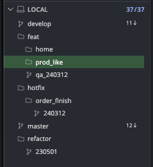
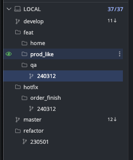

# Git: Branch Strategy

본 문서는 깃 브랜치 전략에 대해 설명 합니다.

기본적으로 git-flow 규칙을 따릅니다.

따라서 관련 문서를 먼저 읽어 오시길 권합니다.

- [git flow 개념 이해하기](https://uxgjs.tistory.com/183)

## Master

**운영 서버**를 대상으로 배포될 수 있는 유일한 브랜치 입니다.

해당 내용은 가장 Stable 해야 합니다.

기본적으로 build 와 test 에 오류가 없어야 합니다.

## Develop

**테스트 혹은 스테이지 서버**를 대상으로 배포될 수 있는 유일한 브랜치 입니다.

해당 내용엔 개발이 끝난 기능(feature)들이 포함될 수 있습니다.

그래서 다른 동료분들이 build 혹은 test 를 진행하는데 오류가 없어야 합니다.

## Feature Branch

- 패턴: `feat/{working_name}`
- 출처:
  - develop -> develop
  - base branch -> develop

기능 개발이나 업데이트 등 평상시의 모든 개발 업무가 이뤄지는 브랜치 입니다.

local 에서 develop 을 기반으로 만들어지며 개발이 끝나면 다시 `develop` 으로 PR과 merge 를 진행합니다.

개발자 각자의 개발 진행중인 내용이므로 반드시 Stable 할 필요는 없습니다.

단, develop 에 merge 될 때는 최소한 build 및 test 에 오류가 없어야 합니다.

> ℹ️ 팁
> 
> `git kraken` 사용을 기준으로, 브랜치명에 슬래시(/)를 응용하면 다음과 같이 브랜치 목록을 폴더처럼 관리 할 수 있습니다.
>
> | before | after |
> | --- | --- |
> | feat/qa_240312 | feat/qa/240312 |
> |  |  |

## Base Branch

- 패턴1: `feat/{working_name}/base`
  - 예시: `feat/product_detail/base`
- 패턴2: `feat/{working_name}/{yyMMdd}_base`
  - 예시: `feat/product_detail/241225_base`
- 출처
  - sub branch -> base branch
  - feature branch -> base branch
- PR 가능 경로
  - base branch -> develop

기능 개발 내용이 많을 때는 commit 과 PR을 나누는 경우가 있습니다.

이렇게 나눠진 PR들은 병합 대상으로써 develop 이나 master 가 아닌 `base branch`를 둘 수 있습니다.

base branch 는 이렇게 나눠진 PR을 받아들이고 merge 가 된 후 작업이 종료되면 최종적으로 `develop` 에 PR 과 merge 를 진행합니다.

> 단순 작업용으로서 `base branch` 를 선택하지 않습니다.
>
> 1회성 혹은 단발성 작업일 경우 `Feature Branch` 나 `Hotfix Branch` 를 활용합니다.

## Sub Branch

- 패턴: `feat/{working_name}[/{yyMMdd}[--Any]]`
  - 예시1: 기본
    - `feat/product_list`
  - 예시2: 같은 목적의 서브 브랜치에 날짜를 붙여 이전 날짜의 작업과 구별할 때
    - `feat/product_list/211225`
  - 예시3: PR로 올릴 용도로 사용. 오늘(12/25) 작성한 여러 브랜치와 구별할 때
    - `feat/product_list/211225--A`
    - `feat/product_list/211225--B`
    - `feat/product_list/211225--C`
    - `feat/product_list/211225--S`
    - `feat/product_list/211225--Z`
  - 예시4: 커밋 순서를 바꾸거나 스쿼시 혹은 병합 등으로 기존에 올라간 날짜와 숫자가 포함된 브랜치와 구별이 필요할 때
    - `feat/product_list/211225--A0`
    - `feat/product_list/211225--A1`
    - `feat/product_list/211225--A2`
    - `feat/product_list/211225--B7`
    - `feat/product_list/211225--D0`
  - 예시5: 단순히 오늘(12/25) 작업중인 내역을 백업하고 싶을 때
    - `feat/product_list/211225--working001`
    - `feat/product_list/211225--working002`
    - `feat/product_list/211225--working003`
    - `feat/product_list/211225--working010`
    - `feat/product_list/211225--working900`
- 출처: working -> sub branch
- PR 가능 경로: sub branch -> base branch

작업 내용이 너무 많아서 `base branch` 를 두고 PR & merge 를 진행할 때 쓰이는 브랜치 입니다.

Sub Branch 는 PR 대상이 반드시 `Base Branch` 여야 합니다.

## Hotfix

- 패턴: `hotfix[/working_name][/yyMMdd[_hhmm]]`
  - 예시1: 관련 작업 명시
    - `hotfix/login_issue`
  - 예시2: 날짜만 명시
    - `hotfix/211224`
  - 예시3: 날짜와 시간 함께 명시
    - `hotfix/211224_1834` - 오후 6시 34분
  - 예시4: 작업명과 날짜 명시
    - `hotfix/login_issue/211224`
  - 예시5: 관련 작업과 일시 포함
    - `hotfix/login_issue/211224_0920` - 오전 9시 20분
- 출처: master -> master

운영에 문제가 있어 급하게 수정하는 핫픽스 계열 업무가 이뤄지는 브랜치 입니다.

local 에서 master 를 기반으로 만들어지며 개발이 끝나면 다시 `master` 로 PR과 merge 를 진행합니다.

## Back Merge

- 별도 브랜치 생성 없음
- 출처: master -> develop

hotfix 를 통해 수정된 master 내용을 develop 에 반영할 때 쓰입니다.

github 기준, master 에서 develop 대상으로 PR 을 올려서 merge 진행합니다.

## Release

- 별도 브랜치 생성 없음
- 출처: develop -> master

feature 브랜치의 개발 내용을 develop 에 merge 되고, 그 내용을 최종 운영 서버에 반영 시킬 때 쓰입니다.

github 기준, develop 에서 master 대상으로 PR 올려서 merge 진행합니다.
