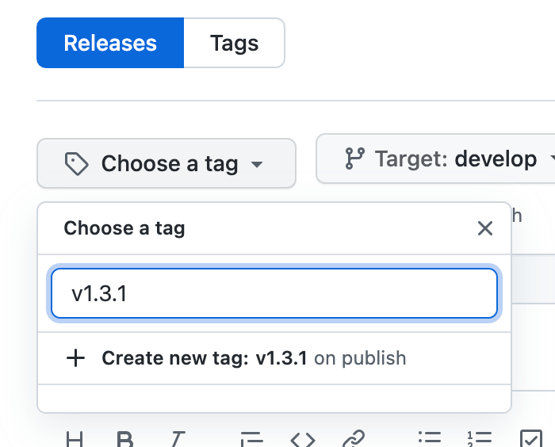
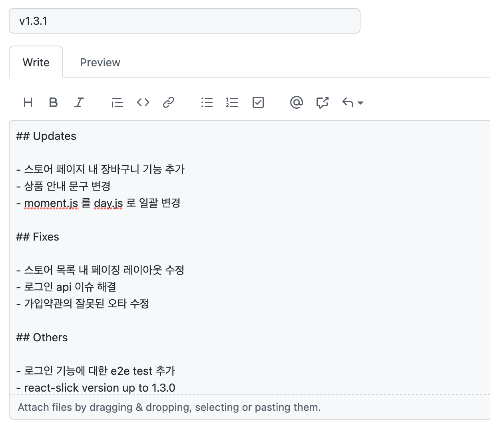

# Version Management

버전은 점(.)을 기준으로 다음과 같이 구분됩니다.

```
<major> . <minor> . <patch>
```

가령 `3.4.6` 이라는 버전이 있다면 각 영역별 버전은 다음과 같습니다.

- major: 3
- minor: 4
- patch: 6

## Major Version

프로젝트에 사용자가 체감할 정도로 큰 변화가 있을 때 버전 숫자를 올립니다.

이 버전이 올라가면, 하위의 `minor 와 patch 는 버전을 0 으로 초기화` 합니다.

아래는 적용되는 작업들에 대한 예시 입니다.

- 테마 변경
- 기반 라이브러리 및 프레임워크 변경
- 대규모 기능 추가 및 변경
  - 예: 스토어 페이지 개편

## Minor Version

일반적인 기능 추가나 변경 등 프로젝트에 작은 변화가 있을 때 버전 숫자를 올립니다.

버그 수정이 아닌 작업들은 대부분 이 버전이 올림 대상 입니다.

이 버전이 올라가면, 하위의 `patch 버전을 0 으로 초기화` 합니다.

아래는 적용되는 작업들에 대한 예시 입니다.

- 특정 페이지 영역에 대한 UX 개선
- 특정 영역에 대한 없던 기능 추가
- 불필요한 기능 제거

## Patch Version

Hotfix 같이 버그 수정이나 이슈 해결이 되었을 때 버전 숫자를 올립니다.

또는 텍스트 변경같은 상대적으로 사소한 변경도 이 버전을 올릴 수 있습니다.

아래는 적용되는 작업들에 대한 예시 입니다.

- 사용자 인증 오류 수정
- 센트리에 9/8일날 발생된 API 수행 예외 수정
- CS/CX 에 의해 전달된 이슈 해결
- 퍼포먼스 저하로 알려진 문제 해결
- 상품 구매 안내문구 수정

## Release Note

[깃 브랜치 전략](./git-branch-strategy.md)에 따라 Hotfix 나 Release 가 이뤄질 때는 반드시 `Release Note` 를 작성합니다.

릴리즈 노트의 양식은 다음과 같습니다.

### 제목과 태그

이들은 버전만 간결하게 작성합니다.
```
v1.3.1
```

<br />



### 본문

작성 시 현재 버전에서의 주요 변경점만 명시 합니다.

가령, `스토어 페이지 내 장바구니 기능 추가` 가 주요 변경점이라면, 이와 함께 특정 라이브러리 버전업이나 기타 수정 사항이 있다면 다음과 같이 작성합니다.

```
## Updates

- 스토어 페이지 내 장바구니 기능 추가
- 상품 안내 문구 변경
- moment.js 를 day.js 로 일괄 변경

## Fixes

- 스토어 목록 내 페이징 레이아웃 수정
- 로그인 api 이슈 해결
- 가입약관의 잘못된 오타 수정

## Others

- 로그인 기능에 대한 e2e test 추가
- react-slick version up to 1.3.0
```

본론의 각 영역은 아래와 같이 3가지가 있으며, 필요한 만큼만 추가하여 기재합니다.

| type | desc. |
| :--- | :---- |
| Updates | 주요 변경사항에 대한 목록. |
| Fixes | 고쳐진 오류나 해결된 이슈 목록. |
| Others | 그 외 언급 하고싶은 목록. |